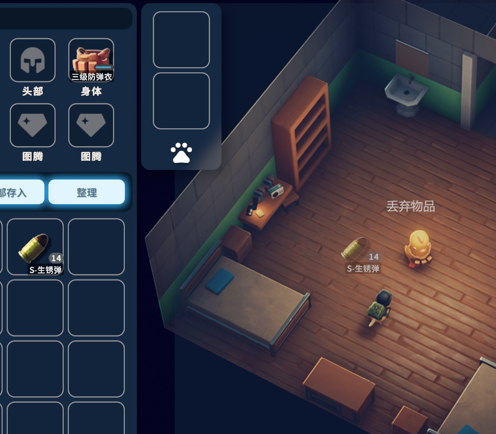

# Duckov_DragToDrop 拖动丢弃物品

This is a mod for game Escape From Duckov.  
逃离鸭科夫的拖动丢弃物品mod。

  
在屏幕中间添加了一个区域，可以把背包/仓库里的物品拖进去来丢到地上。

编译前请将`DragToDrop.csproj`中的`<DuckovPath>E:\programs\steam\steamapps\common\Escape from Duckov</DuckovPath>`改为你电脑中的对应路径。

template: https://github.com/xvrsl/duckov_modding#/  
steam community: https://steamcommunity.com/sharedfiles/filedetails/?id=3593505938  
bilibili: https://www.bilibili.com/video/BV1kSsfznEf1/
